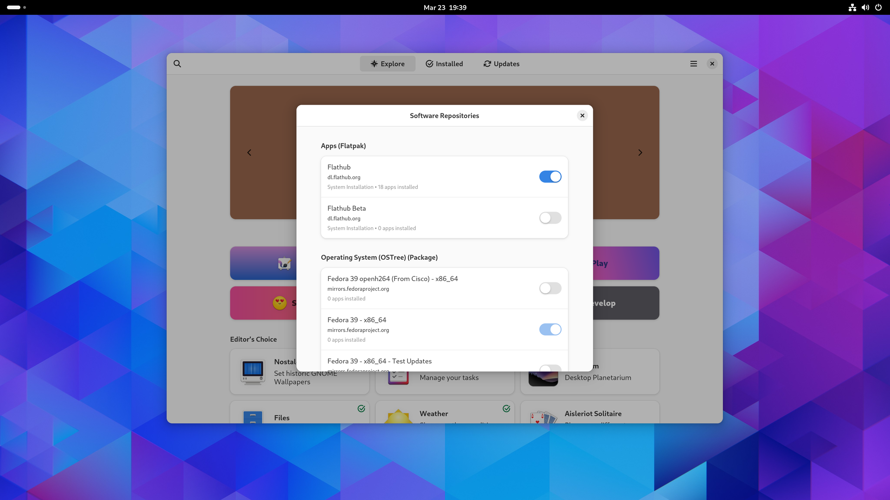

[BlueVanilla][1]
================

A Fedora Silverblue image that uses vanilla GNOME and FlatHub apps.

<picture>
  <source media="(prefers-color-scheme: light)" srcset=".github/screenshot-light.png">
  <source media="(prefers-color-scheme: dark)"  srcset=".github/screenshot-dark.png">
  
</picture>

Usage
-----

1. Rebase to an unsigned image to get proper signing keys:

       rpm-ostree rebase -r ostree-unverified-registry:ghcr.io/aguslr/bluevanilla:stable

2. Rebase to a signed image to finish the installation:

       rpm-ostree rebase -r ostree-image-signed:docker://ghcr.io/aguslr/bluevanilla:stable

Alternatively, an [ISO file for offline installation][7] can be generated with
the following command:

    sudo podman run --rm --privileged \
        --volume .:/build-container-installer/build \
        --security-opt label=disable --pull=newer \
        ghcr.io/jasonn3/build-container-installer:latest \
        IMAGE_REPO="ghcr.io/aguslr" \
        IMAGE_NAME="bluevanilla" \
        IMAGE_TAG="latest" \
        VARIANT="Silverblue"

Features
--------

- Start with a base Fedora Silverblue image.
- Add the `gnome-tweaks` package.
- Restore GNOME's default background.
- Replace Fedora repository with unfiltered Flathub repository.
- Replace Fedora's Flatpaks with the ones from Flathub.
- Remove unused Flatpak dependencies automatically.
- Set automatic checking of updates for the system.
- Reduce *systemd* shutdown timers.

Verification
------------

These images are signed with Sisgstore's [Cosign][5]. You can verify the
signature by downloading the `cosign.pub` key from this repo and running the
following command:

    cosign verify --key cosign.pub ghcr.io/aguslr/bluevanilla

References
----------

- [Building your own custom Fedora Silverblue image][2]
- [GitHub - ublue-os/base: Base image: Silverblue with unfiltered Flathub,
  distrobox, and automatic updates][3]
- [GitHub - ublue-os/ubuntu: Fedora Silverblue for Ubuntu Expatriates][4]
- [Cosign - Sigstore Documentation][5]
- [Making your Own - Universal Blue][6]

[1]: https://github.com/aguslr/bluevanilla
[2]: https://www.ypsidanger.com/building-your-own-fedora-silverblue-image/
[3]: https://github.com/ublue-os/base
[4]: https://github.com/ublue-os/ubuntu
[5]: https://docs.sigstore.dev/cosign/overview/
[6]: https://ublue.it/making-your-own/
[7]: https://blue-build.org/learn/universal-blue/#fresh-install-from-an-iso
